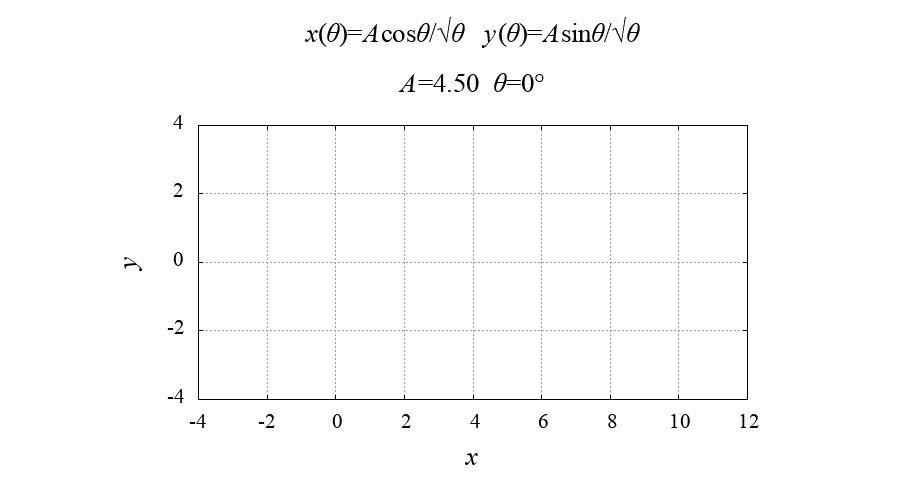

# Lituus
"lituus" is a simulator of **lituus curve** with gnuplot.

## Demo
||
|:---:|
|**lituus.gif**|

## Equations


<!-- ## Features
You enable to switch terminal type `qt` or `pngcairo` by using **`qtMode`**.
- If you select `qt` terminal (`qtMode==1`), gnuplot opens qt window and you can run this simulator.
The drawing speed of the qt window can be adjusted with the `pause` command and the variable `DELAY_TIME`.

- On the other hand, in `pngcairo` terminal (`qtMode!=1`), you can get a lot of PNG images of the simulation.
By using the outputted images, you can make a video or an animated GIF. -->

<!-- # Operating environment -->
## Requirement
- macOS Big Sur 12.2 / Macbook Air (M1, 2020) 16GB
- gnuplot version 5.4 patchlevel 3

<!-- # Installation -->
 
## Usage
```
git clone https://github.com/hiroloquy/lituus.git
cd lituus
gnuplot
load 'lituus.plt'
```

## Author
* Hiro Shigeyoshi
* Twitter: [@hiroloquy](https://twitter.com/hiroloquy)

### Blog
Under construction...
<!-- This article is written in detail and in Japanese. You can translate it in your language.  
https://hiroloquy.com/2021/07/11/rounded-pentagram-animation/ -->

### YouTube
https://youtu.be/vz9N5GG8Tfw  
[![Lituus Animation [gnuplot]](http://img.youtube.com/vi/vz9N5GG8Tfw/0.jpg)](https://youtu.be/vz9N5GG8Tfw "Lituus Animation [gnuplot]")

## License
"lituus" is under [MIT license](https://github.com/hiroloquy/inverted-pendulum-simulation/blob/master/LICENSE).
 
